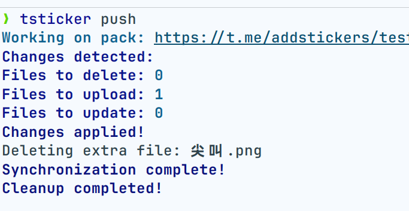

# tsticker

[](https://badge.fury.io/py/tsticker) [](https://pepy.tech/project/tsticker)

## 📘 Overview

`tsticker` is a command-line interface (CLI) tool designed to streamline the creation and management of Telegram
stickers. It automatically adjusts image sizes and suggests appropriate emojis based on image names. The tool supports
both static and animated stickers (in webm format).

Just by adding or deleting files, you can easily update the contents of your sticker pack - making it incredibly
user-friendly!



## ✨ Key Features

- **Emoji Suggestions:** Automatically suggests emojis based on image names, enhancing user experience.
- **Automatic Image Adjustment:** Resizes and adjusts images to meet Telegram's sticker requirements.
- **Support for Multiple Sticker Types:** Manages both static and animated stickers seamlessly.
- **git-like Operations:** Follows a workflow similar to Git with `init`, `sync`, and `push` commands.
- **Support Gif Conversion:** No problem with transparent background GIF conversion.

## 📋 Prerequisites

Ensure the following dependencies are installed before using `tsticker`:

| Dependency | Installation Link                                   |
|------------|-----------------------------------------------------|
| **ffmpeg** | [Download ffmpeg](https://ffmpeg.org/download.html) |

## 🛠️ Installation

### Installing Dependencies

Install necessary dependencies based on your operating system:

You need install [ImageMagick](https://docs.wand-py.org/en/0.6.12/guide/install.html) before using this CLI.

Install Guide: https://docs.wand-py.org/en/0.6.12/guide/install.html

### Installing `tsticker`

The recommended way to install `tsticker` is through `pipx` for isolated environments:

```bash
pipx install tsticker
```

If `pipx` is not installed, install it with the following commands:

```bash
python3 -m pip install --user pipx
python3 -m pipx ensurepath
```

If you want to upgrade `tsticker` to the latest version, use the following command:

```bash
pipx upgrade tsticker
```

## 🔑 Bot Token Setup

To create and manage stickers with `tsticker`, you need a Telegram Bot Token. Follow these steps:

1. Open Telegram and search for the [BotFather](https://t.me/BotFather) bot.
2. Start a conversation with BotFather and send the command `/newbot`.
3. Follow the instructions to create your bot and acquire the bot token.

The bot token provided by BotFather will be used as your `BotToken`.

We use https://pypi.org/project/keyring/ to manage your tokens, which may require additional steps. If you encounter
problems, refer to: https://github.com/jaraco/keyring

## 🚀 Usage

### Initial Setup

**Log in to your Telegram account:**

```bash
tsticker login -t <token> -u <user>
```

Replace `<token>` with your Telegram bot token and `<user>` with your Telegram user ID (you can get your user ID
from [getidsbot](https://t.me/getidsbot)).

### Main Commands

| Command         | Description                                                                        |
|-----------------|------------------------------------------------------------------------------------|
| `tsticker init` | Initializes a new sticker pack.                                                    |
| `tsticker sync` | Syncs the sticker pack from your local directory with changes from the cloud.      |
| `tsticker push` | Pushes changes from your local directory to the cloud, updating existing stickers. |

**Example usage:**

```bash
mkdir <folder_name>
cd <folder_name>
tsticker init -n <pack_name> -t <pack_title>
```

- `<pack_name>`: The desired directory name for your sticker pack.
- `<pack_title>`: The title for your sticker pack.

### Adding or Removing Stickers

To manage your stickers, simply add or remove images or animated files (GIFs/WebMs) in `<pack>/stickers` directory. After
making changes, use the following command to synchronize with your Telegram sticker pack:

```bash
tsticker push
```

If you encounter any issues, please [create a new Issue](https://github.com/sudoskys/tsticker/issues) on our GitHub
repository.

## ⚠️ Important Notes

| Note                             | Description                                                                                                                                                                       |
|----------------------------------|-----------------------------------------------------------------------------------------------------------------------------------------------------------------------------------|
| **No Support for Tgs Stickers**  | `tgs` format is not supported for this cli.                                                                                                                                       |
| **Rate Limiting**                | Each request is throttled to 2 seconds to avoid being blocked by Telegram.                                                                                                        |
| **Limited Emoji Auto-Selection** | Automatic emoji selection may not work optimally for all languages, primarily supported for English. check `github@telegram_sticker_utils:telegram_sticker_utils/core/rules.json` |
| **Rate Limits**                  | Avoid excessive uploads in a short period to prevent Telegram from throttling your bot's actions.                                                                                 |
| **Security**                     | Keep your bot token secure. Stickers can only be managed through your bot or the official @Stickers bot by the sticker pack creator.                                              |

## 📄 License

`tsticker` is released under the MIT License. See [LICENSE](LICENSE) for more information.

## 🤝 Contributing

Contributions are welcome! If you want to contribute, please follow our [Contributing Guide](CONTRIBUTING.md).

## 🙏 Acknowledgments

Special thanks to all contributors who have made `tsticker` better. For issues or feature requests, please use
the [GitHub issue tracker](https://github.com/sudoskys/tsticker/issues).

---

Enhance your Telegram sticker creation process with `tsticker` and become part of our community striving to simplify
sticker management through the command line!

---